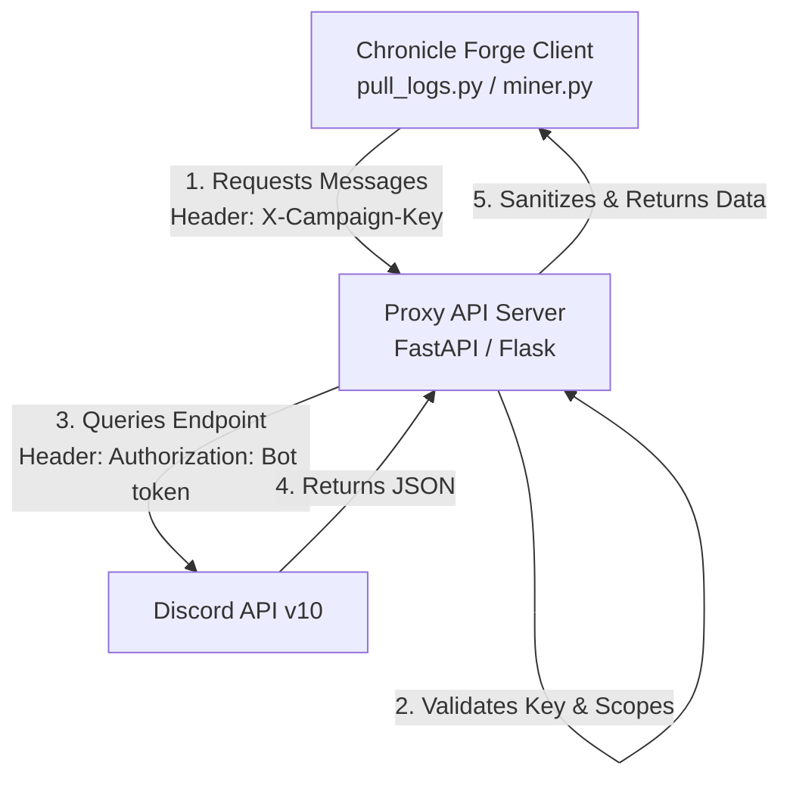

# Technical & Implementation Plan: Shared Bot Proxy API

This document details the architecture and step-by-step implementation plan for introducing a secure Proxy API to handle requests from the Chronicle Forge client (`pull_logs.py` / `miner.py`) via a shared Discord Bot.

---

## 1. Architecture Overview

To prevent exposing the shared Discord Bot Token (`DISCORD_TOKEN`) to users running the client locally or in GitHub Actions, we introduce a lightweight Proxy API server.



---

## 2. Security & Access Control

To ensure that campaigns can only read data from their own Discord guilds and channels, the Proxy API will implement a simple key-mapping validation:

1. **Campaign API Keys**: Each campaign registered with the shared bot is assigned a unique `X-Campaign-Key` (stored in the proxy database/config).
2. **Channel-to-Campaign Mapping**: The proxy database maintains a mapping of allowed `channel_id` / `guild_id` values per Campaign Key.
3. **Validation logic**:
   * If a client requests `GET /api/v1/channels/{channel_id}/messages`, the proxy server validates that `{channel_id}` is registered under the campaign associated with the provided `X-Campaign-Key`.
   * If validation fails, the proxy returns `403 Forbidden`.

---

## 3. Proxy API Endpoints

The proxy server will mirror the subset of the Discord API used by Chronicle Forge:

### A. Get Channel Metadata
* **Endpoint**: `GET /api/v1/channels/{channel_id}`
* **Headers**: `X-Campaign-Key: <key>`
* **Response**: Returns JSON schema matching the Discord Channel object.

### B. Fetch Channel Messages (Pagination)
* **Endpoint**: `GET /api/v1/channels/{channel_id}/messages`
* **Headers**: `X-Campaign-Key: <key>`
* **Query Parameters**:
  * `limit` (default: 100)
  * `before` (optional)
  * `after` (optional)
* **Response**: List of message objects.

---

## 4. Client Changes (`ChronicleForge`)

We will introduce a hybrid connection model in the `Miner` class:

1. **Configuration**:
   * If `DISCORD_TOKEN` is present in `.env`, the client connects **directly** to the Discord API (Private Bot Mode).
   * If `FORGE_PROXY_URL` and `FORGE_CAMPAIGN_KEY` are present, the client connects to the **Proxy API** (Shared Bot Mode).

2. **Refactoring `miner.py`**:
   Adjust the REST client helper to point to the proxy endpoints:
   ```python
   class Miner:
       def __init__(self, token=None, proxy_url=None, campaign_key=None, dry_run=False):
           self.token = token
           self.proxy_url = proxy_url
           self.campaign_key = campaign_key
           # ...

       def _api_get(self, endpoint, params=None):
           if self.proxy_url:
               url = f"{self.proxy_url}/api/v1/{endpoint}"
               headers = {"X-Campaign-Key": self.campaign_key}
               # Make HTTP request using headers
           else:
               url = f"{self.base_url}/{endpoint}"
               headers = {"Authorization": f"Bot {self.token}"}
               # Make direct Discord call
   ```

---

## 5. Implementation Roadmap

### Phase 1: Proxy API Server Prototype
* Build a lightweight FastAPI application.
* Implement API Key authentication middleware.
* Define in-memory or database configuration mapping Campaign Keys to allowed Discord Guilds/Channels.
* Setup CORS and proxy routing to Discord.

### Phase 2: Client Integration
* Implement proxy routing config flags in `ChronicleForge/scripts/config.py`.
* Refactor `ChronicleForge/scripts/miner.py` and `pull_logs.py` to route requests through the proxy when configured.

### Phase 3: Deployment & Testing
* Deploy the Proxy API service on your central server/node.
* Invite the Shared Bot to test servers and verify that logs can be pulled securely without local tokens.
